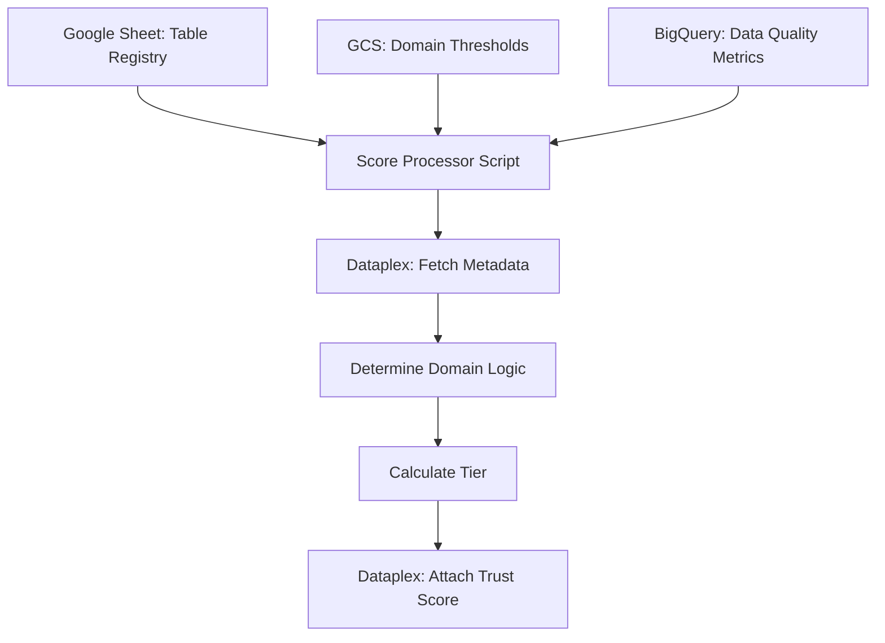

# Trust Score Automation

This service automates the process of calculating and attaching "Trust Scores" to BigQuery tables within the Google Cloud Dataplex Catalog. It acts as a bridge between raw Data Quality (DQ) results and the metadata visible to data consumers.

## What it does

Data Quality scores are often buried in BigQuery tables that users never see. This script:
1.  **Identifies Target Tables:** Reads a curated list of tables from a Google Spreadsheet.
2.  **Fetches DQ Metrics:** Pulls the latest quality scores from a central BigQuery results table.
3.  **Contextualizes Quality:** Looks at the table's "Domain" (e.g., Finance vs. Marketing) stored in Dataplex to determine which quality thresholds to apply.
4.  **Publishes Metadata:** Updates the Dataplex Entry for that table with a human-readable Trust Score (High, Medium, Low) and a timestamp.

## How it works

The application follows a linear pipeline:

1.  **Config & Thresholds:** It loads `dq_thresholds.json` from GCS. This file defines what constitutes a "High" or "Medium" score for different business domains.
2.  **The Registry:** It connects to a Google Sheet (using `gspread`) to get the list of BQ tables (`project`, `dataset`, `table_id`) that need trust scoring.
3.  **BigQuery Lookup:** It runs a Window Function query against the central DQ table to grab the most recent execution result for every table in the registry.
4.  **Dataplex Enrichment:**
    *   For each table, it fetches the current Dataplex Entry.
    *   It scans existing **Governance Aspects** to find the `DataDomain`.
    *   It maps the BQ score against the domain-specific thresholds.
    *   It pushes a **Trust Aspect** back to Dataplex containing the tier and the evaluation time.

## System Flow

## Configuration

The behavior is controlled via `config.yaml`. Key parameters include:
*   `DQ_TABLE`: The source of truth for your quality metrics.
*   `SPREADSHEET_ID`: The registry of tables to process.
*   `TRUST_ASPECT_TYPE`: The resource name of the Dataplex Aspect Type used for the score.
*   `CONFIG_BUCKET`: The GCS bucket containing `dq_thresholds.json`.

## Prerequisites

*   **Service Account:** Requires permissions for BigQuery (Data Viewer/Job User), GCS (Object Viewer), and Dataplex (Catalog Editor).
*   **Google Sheets API:** The service account must have access to the Google Sheet defined in the config.
*   **Dataplex Aspects:** The `DataDomain` must be populated in a Governance-related aspect for domain-specific scoring to work; otherwise, it defaults to a standard benchmark.

## Logic Breakdown: Scoring

Scores are categorized based on the `dq_thresholds.json` mapping:

| Score Range (Example) | Tier |
| :--- | :--- |
| >= 0.95 | **High** |
| >= 0.80 | **Medium** |
| < 0.80 | **Low** |
| No Result | **Unknown** |

## Execution

The script is designed to run as a standalone job (e.g., via Cloud Run Jobs or a scheduled VM).